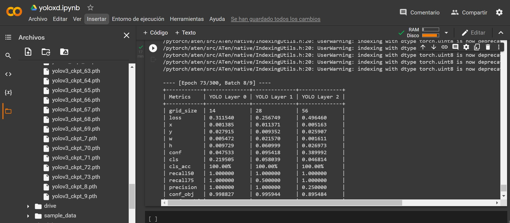

# Implementación:

### entorno en conda
Porblemas con la version de google se usa python 3.7

  	$ conda create -n YoloCustom anaconda python=3.7
	
	$ conda activate YoloCustom
  
  	$ pip install opencv-python numpy matplotlib tensorboard terminaltables pillow tqdm
  
  	$ conda install pytorch==1.1.0 torchvision==0.3.0 cudatoolkit=10.0 -c pytorch

  
### Entrenamiento en google colab
Para colab la modificaciones sera:torch = 1.9.0 y torchvision=0.4.
Tambien se agregara cuda 9 ya colab usa cuda 10 en adelanta.

  	$!pip install torch==1.9 torchvision==0.3
  
  	$!pip install opencv-python numpy matplotlib tensorboard terminaltables pillow tqdm
  
  	$!git clone https://github.com/DavidReveloLuna/Yolov3Custom.git
  
  	$cd Yolov3Custom
  
  	$import urllib.request

  	$urllib.request.urlretrieve('https://pjreddie.com/media/files/darknet53.conv.74','/content/Yolov3Custom/weights/darknet53.conv.74')
	
	$!wget https://developer.nvidia.com/compute/cuda/9.0/Prod/local_installers/cuda-repo-ubuntu1604-9-0-local_9.0.176-1_amd64-deb

	$!dpkg -i cuda-repo-ubuntu1604-9-0-local_9.0.176-1_amd64-deb

	$!apt-get update

	$!apt-get install cuda=9.0.176-1

	$!pip install torchvision==0.4.0

  Entrar al directorio /usr/local/lib/libpackages/torchvision/transforms/functional.py
  
  Cambiar esta línea
  
	from PIL import Image, ImageOps, ImageEnhance, PILLOW_VERSION
	
  Por esta
  
    from PIL import Image, ImageOps, ImageEnhance, __version__ as PILLOW_VERSION
    
  Entrenamiento
	
  	$!python train.py --model_def config/yolov3-custom3C.cfg --data_config config/custom.data --epochs 200 --batch_size 4 --pretrained_weights weights/darknet53.conv.74

solo debido al almasenamiento solo se pudieron dar 73 epocas

  
### Prueba local en imágen y video

   Descargar el archivo .pth y copiarlo en el directorio checkpoints local
   
   	python detectC.py --image_folder data/samplesC/ --model_def config/yolov3-custom3C.cfg --weights_path checkpoints/yolov3_ckpt_252.pth --class_path data/custom/classes.names
   
### resultados con 73 epocas

### Basado en el trabajo de Erik Linder
   https://github.com/eriklindernoren

